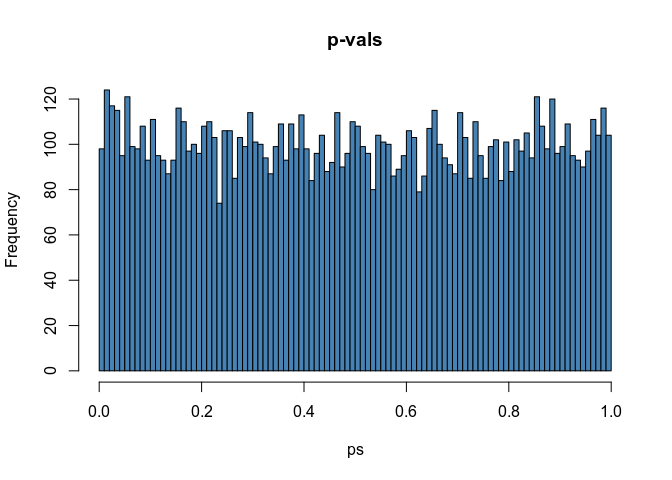

Clustering
================
Pietro Franceschi
January 28, 2018

# Multiple testing

As we discussed, we call “statistical testing” the framework that allows
us to measure the confidence of some hypothesis we are making on the
data. As always we would like to be able to derive general conclusions
of **scientific** value, but unfortunately we are observing only a
subset of the population, and it can be that strange7interesting
phenomena happens only by chance.

## Random differences

Let’s consider a comparison of 10 vs 10 samples extracted from the same
population

``` r
a <- rnorm(10)
b <- rnorm(10)

## my t-test
myttest <- t.test(a,b)
myttest$p.value
```

    ## [1] 0.7768526

If I run the previous chunk several times, you will see that the number
is changing and, if you are sufficiently patient, evetually you will
find what you would identify as a significant difference

Now, if you are measuring several properties on the same set of samples
(protein concentration, metabolite levels, bacterial abundances), you
are in substance running “in parallel” a battery of tests, so it is
obvious that you could find low p-values only by chance

``` r
## 10000 tests (measuring 10000 metabolites)

ps <- rep(0,10000)
for(i in 1:10000){
  a <- rnorm(10)
  b <- rnorm(10)
  ## my t-test
  myttest <- t.test(a,b)
  ps[i] <- myttest$p.value

}

ps[1:30]
```

    ##  [1] 0.05178748 0.82982037 0.44178691 0.91751035 0.42180798 0.39714198
    ##  [7] 0.71613302 0.46639152 0.36774442 0.62992759 0.18867238 0.86192062
    ## [13] 0.31430433 0.50636295 0.38948674 0.51863585 0.30767232 0.11210615
    ## [19] 0.29978030 0.86108708 0.30983019 0.55047235 0.47848385 0.16929795
    ## [25] 0.51703384 0.27085051 0.59816445 0.18786830 0.30789518 0.17975501

and ow let’s look to the distribution of p-values

``` r
hist(ps, col = "steelblue", main = "p-vals", breaks = 100)
```

<!-- -->

  - we have always low p-values
  - we have “true” differences by chance
  - we cannot conclude that the two groups are different\!

## Real Dataset
