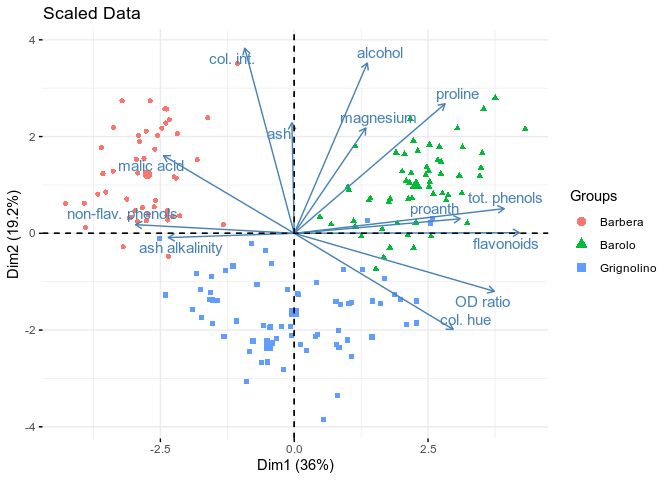
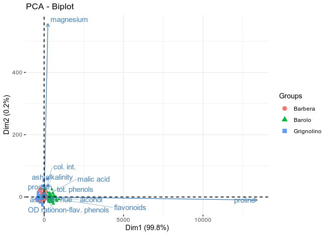
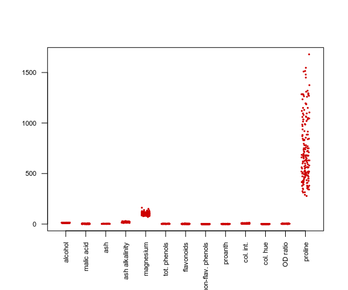
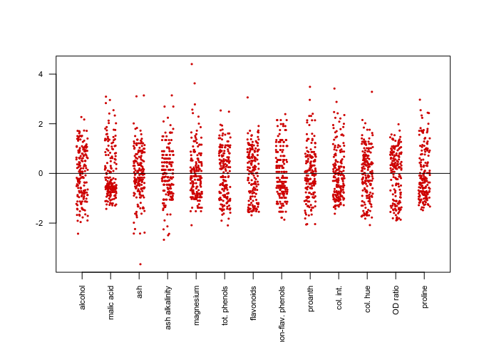
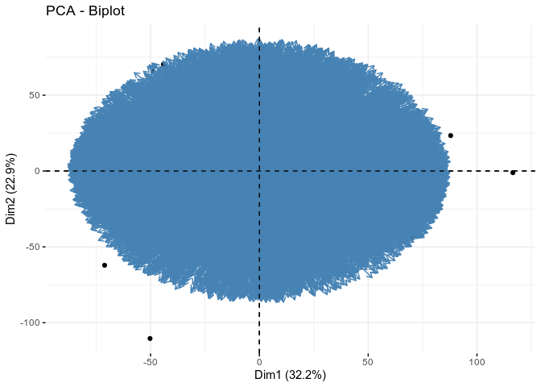
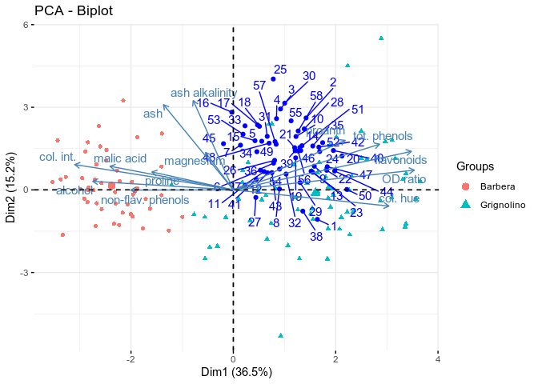

PCA
================
Pietro Franceschi
January 28, 2018

This demo still deals with PCA. In particular we apply it to the wines
dataset.

PCA in R can be performed with many different packages, here we will use
two of them which are characterized by an optimal trade off between
flexibility and ease to use. The two packages are `FactoMineR` and
`factoextra`. An excellent introduction to their use can be found
[there](http://www.sthda.com/english/wiki/factoextra-r-package-easy-multivariate-data-analyses-and-elegant-visualization)

Both packages are not part of the standard R installation. To directly
install them just type

``` r
# install.packages("FactoMineR")
# install.packages("Factoextra")
```

## PCA of Wines Dataset

First of all we load the data and the two R packages

``` r
library(FactoMineR)
library(factoextra)
```

    ## Loading required package: ggplot2

    ## Welcome! Related Books: `Practical Guide To Cluster Analysis in R` at https://goo.gl/13EFCZ

``` r
load("data/wines.RData")
head(wines)
```

    ##      alcohol malic acid  ash ash alkalinity magnesium tot. phenols flavonoids
    ## [1,]   13.20       1.78 2.14           11.2       100         2.65       2.76
    ## [2,]   13.16       2.36 2.67           18.6       101         2.80       3.24
    ## [3,]   14.37       1.95 2.50           16.8       113         3.85       3.49
    ## [4,]   13.24       2.59 2.87           21.0       118         2.80       2.69
    ## [5,]   14.20       1.76 2.45           15.2       112         3.27       3.39
    ## [6,]   14.39       1.87 2.45           14.6        96         2.50       2.52
    ##      non-flav. phenols proanth col. int. col. hue OD ratio proline
    ## [1,]              0.26    1.28      4.38     1.05     3.40    1050
    ## [2,]              0.30    2.81      5.68     1.03     3.17    1185
    ## [3,]              0.24    2.18      7.80     0.86     3.45    1480
    ## [4,]              0.39    1.82      4.32     1.04     2.93     735
    ## [5,]              0.34    1.97      6.75     1.05     2.85    1450
    ## [6,]              0.30    1.98      5.25     1.02     3.58    1290

Since this `wines` is a matrix, we transform it to a data frame adding
also the info about the wine type

``` r
winesdf <- cbind.data.frame(class = vintages, wines)
str(winesdf)
```

    ## 'data.frame':    177 obs. of  14 variables:
    ##  $ class            : Factor w/ 3 levels "Barbera","Barolo",..: 2 2 2 2 2 2 2 2 2 2 ...
    ##  $ alcohol          : num  13.2 13.2 14.4 13.2 14.2 ...
    ##  $ malic acid       : num  1.78 2.36 1.95 2.59 1.76 1.87 2.15 1.64 1.35 2.16 ...
    ##  $ ash              : num  2.14 2.67 2.5 2.87 2.45 2.45 2.61 2.17 2.27 2.3 ...
    ##  $ ash alkalinity   : num  11.2 18.6 16.8 21 15.2 14.6 17.6 14 16 18 ...
    ##  $ magnesium        : num  100 101 113 118 112 96 121 97 98 105 ...
    ##  $ tot. phenols     : num  2.65 2.8 3.85 2.8 3.27 2.5 2.6 2.8 2.98 2.95 ...
    ##  $ flavonoids       : num  2.76 3.24 3.49 2.69 3.39 2.52 2.51 2.98 3.15 3.32 ...
    ##  $ non-flav. phenols: num  0.26 0.3 0.24 0.39 0.34 0.3 0.31 0.29 0.22 0.22 ...
    ##  $ proanth          : num  1.28 2.81 2.18 1.82 1.97 1.98 1.25 1.98 1.85 2.38 ...
    ##  $ col. int.        : num  4.38 5.68 7.8 4.32 6.75 5.25 5.05 5.2 7.22 5.75 ...
    ##  $ col. hue         : num  1.05 1.03 0.86 1.04 1.05 1.02 1.06 1.08 1.01 1.25 ...
    ##  $ OD ratio         : num  3.4 3.17 3.45 2.93 2.85 3.58 3.58 2.85 3.55 3.17 ...
    ##  $ proline          : num  1050 1185 1480 735 1450 ...

Now we see more clearly the structure of the data, and we can easily use
the summary to get some feeling on the
    situation

``` r
summary(winesdf)
```

    ##         class       alcohol        malic acid        ash        ash alkalinity 
    ##  Barbera   :48   Min.   :11.03   Min.   :0.74   Min.   :1.360   Min.   :10.60  
    ##  Barolo    :58   1st Qu.:12.36   1st Qu.:1.60   1st Qu.:2.210   1st Qu.:17.20  
    ##  Grignolino:71   Median :13.05   Median :1.87   Median :2.360   Median :19.50  
    ##                  Mean   :12.99   Mean   :2.34   Mean   :2.366   Mean   :19.52  
    ##                  3rd Qu.:13.67   3rd Qu.:3.10   3rd Qu.:2.560   3rd Qu.:21.50  
    ##                  Max.   :14.83   Max.   :5.80   Max.   :3.230   Max.   :30.00  
    ##    magnesium       tot. phenols     flavonoids    non-flav. phenols
    ##  Min.   : 70.00   Min.   :0.980   Min.   :0.340   Min.   :0.1300   
    ##  1st Qu.: 88.00   1st Qu.:1.740   1st Qu.:1.200   1st Qu.:0.2700   
    ##  Median : 98.00   Median :2.350   Median :2.130   Median :0.3400   
    ##  Mean   : 99.59   Mean   :2.292   Mean   :2.023   Mean   :0.3623   
    ##  3rd Qu.:107.00   3rd Qu.:2.800   3rd Qu.:2.860   3rd Qu.:0.4400   
    ##  Max.   :162.00   Max.   :3.880   Max.   :5.080   Max.   :0.6600   
    ##     proanth        col. int.         col. hue        OD ratio    
    ##  Min.   :0.410   Min.   : 1.280   Min.   :0.480   Min.   :1.270  
    ##  1st Qu.:1.250   1st Qu.: 3.210   1st Qu.:0.780   1st Qu.:1.930  
    ##  Median :1.550   Median : 4.680   Median :0.960   Median :2.780  
    ##  Mean   :1.587   Mean   : 5.055   Mean   :0.957   Mean   :2.604  
    ##  3rd Qu.:1.950   3rd Qu.: 6.200   3rd Qu.:1.120   3rd Qu.:3.170  
    ##  Max.   :3.580   Max.   :13.000   Max.   :1.710   Max.   :4.000  
    ##     proline      
    ##  Min.   : 278.0  
    ##  1st Qu.: 500.0  
    ##  Median : 672.0  
    ##  Mean   : 745.1  
    ##  3rd Qu.: 985.0  
    ##  Max.   :1680.0

Let’s do some PCA, first of all consider the scaled and unscaled results

``` r
winesPCA.scaled <- PCA(winesdf[,2:14],
                       scale.unit = TRUE,
                       graph = FALSE)
fviz_pca_biplot(winesPCA.scaled, 
                habillage = winesdf$class,
                label = "var", # show variable names
                repel = TRUE) 
```

<!-- -->

``` r
winesPCA <- PCA(winesdf[,2:14],
                scale.unit = FALSE,
                graph = FALSE
                ) 
fviz_pca_biplot(winesPCA, 
                habillage = winesdf$class,
                label = "var", # show variable names
                repel = TRUE) 
```

<!-- -->

Now some questions:

  - What can you see about the sample wines?
  - What can you say about the relations (correlation) between the
    variables?
  - Which are the most discriminating variables?
  - Why the two previous plots are so different?

Let’s give a look to the scaled and unscaled raw data …

``` r
stripchart(winesdf[,2:14],
           vertical = TRUE,
           method = "jitter",
           jitter = 0.2,
           pch = 19,
           col = "red3",
           cex = 0.3)
```

<!-- -->

And their scale counterpart …

``` r
stripchart(as.data.frame(scale(winesdf[,2:14])),
           vertical = TRUE,
           method = "jitter",
           jitter = 0.2,
           pch = 19,
           col = "red3",
           cex = 0.3)
abline(h=0)
```

<!-- -->

## PCA of the gene expression data

To finish this part let’s give a fat look to the gene expression data …

``` r
## Load the data
load("data/rnaseq.RData")

dim(countsn)
```

    ## [1] 12058    12

So here we have 12 samples and more than 12 thousands variables, and
samples are in column. First of all we have to turn the matrix

``` r
countsn <- t(countsn)

dim(countsn)
```

    ## [1]    12 12058

Let’s give a look to the PCA

``` r
genesPCA <- PCA(countsn,
                scale.unit = TRUE,
                graph = FALSE)
summary(genesPCA)
```

    ## 
    ## Call:
    ## PCA(X = countsn, scale.unit = TRUE, graph = FALSE) 
    ## 
    ## 
    ## Eigenvalues
    ##                         Dim.1    Dim.2    Dim.3    Dim.4    Dim.5    Dim.6
    ## Variance             3885.368 2761.475 1664.407  805.383  667.202  542.797
    ## % of var.              32.222   22.902   13.803    6.679    5.533    4.502
    ## Cumulative % of var.   32.222   55.124   68.927   75.607   81.140   85.641
    ##                         Dim.7    Dim.8    Dim.9   Dim.10   Dim.11
    ## Variance              488.028  364.640  330.186  281.315  267.199
    ## % of var.               4.047    3.024    2.738    2.333    2.216
    ## Cumulative % of var.   89.689   92.713   95.451   97.784  100.000
    ## 
    ## Individuals (the 10 first)
    ##              Dist      Dim.1      ctr     cos2      Dim.2      ctr     cos2  
    ## 1      |   88.151 |   26.671    1.526    0.092 |   16.516    0.823    0.035 |
    ## 2      |  107.857 |   87.894   16.569    0.664 |   23.360    1.647    0.047 |
    ## 3      |  134.288 |  116.482   29.101    0.752 |   -1.073    0.003    0.000 |
    ## 4      |  121.235 |   69.899   10.479    0.332 |  -43.831    5.797    0.131 |
    ## 5      |  102.182 |  -44.137    4.178    0.187 |   70.221   14.880    0.472 |
    ## 6      |   94.969 |   44.058    4.163    0.215 |  -10.876    0.357    0.013 |
    ## 7      |  138.559 |  -50.253    5.416    0.132 | -110.399   36.780    0.635 |
    ## 8      |   87.268 |  -53.378    6.111    0.374 |    4.425    0.059    0.003 |
    ## 9      |  122.723 |  -71.135   10.853    0.336 |  -62.102   11.638    0.256 |
    ## 10     |  102.307 |  -43.164    3.996    0.178 |   67.955   13.935    0.441 |
    ##           Dim.3      ctr     cos2  
    ## 1        40.966    8.403    0.216 |
    ## 2        26.735    3.579    0.061 |
    ## 3        37.486    7.035    0.078 |
    ## 4       -70.391   24.808    0.337 |
    ## 5       -20.441    2.092    0.040 |
    ## 6       -45.933   10.563    0.234 |
    ## 7       -31.703    5.032    0.052 |
    ## 8        -3.567    0.064    0.002 |
    ## 9        44.924   10.105    0.134 |
    ## 10      -39.492    7.809    0.149 |
    ## 
    ## Variables (the 10 first)
    ##           Dim.1    ctr   cos2    Dim.2    ctr   cos2    Dim.3    ctr   cos2  
    ## V1     | -0.251  0.002  0.063 |  0.861  0.027  0.741 | -0.163  0.002  0.027 |
    ## V2     | -0.445  0.005  0.198 |  0.526  0.010  0.277 | -0.339  0.007  0.115 |
    ## V3     |  0.260  0.002  0.068 | -0.540  0.011  0.292 | -0.170  0.002  0.029 |
    ## V4     | -0.424  0.005  0.180 |  0.385  0.005  0.149 |  0.378  0.009  0.143 |
    ## V5     | -0.732  0.014  0.536 |  0.235  0.002  0.055 |  0.427  0.011  0.183 |
    ## V6     | -0.841  0.018  0.707 |  0.311  0.003  0.097 | -0.316  0.006  0.100 |
    ## V7     |  0.371  0.004  0.138 |  0.705  0.018  0.497 | -0.112  0.001  0.012 |
    ## V8     | -0.687  0.012  0.471 |  0.648  0.015  0.420 |  0.098  0.001  0.010 |
    ## V9     | -0.922  0.022  0.850 | -0.094  0.000  0.009 |  0.086  0.000  0.007 |
    ## V10    |  0.759  0.015  0.576 | -0.427  0.007  0.182 |  0.049  0.000  0.002 |

What we see in terms of variance?

``` r
fviz_pca_biplot(genesPCA, 
                label = "none") 
```

<!-- -->

Olalà\!

  - Why this plot?
  - What is telling us?
  - Is something unexpected?

## Projections

We mentioned that to compare new and old data by PCA the “new” samples
should be projected on the old PCA, otherwise the projection plane will
be different. This is the most wise way to assess if new samples are
compatible with the old ones. Let’s see how this can be done on the
wines dataset.

To this purpose we project the “Barolo” samples on the PCA costructed on
the rest of the dataset

``` r
proj.winesPCA <-PCA(winesdf[,2:14],
                       scale.unit = TRUE,
                       graph = FALSE,
                       ind.sup = which(winesdf$class == "Barolo"))
fviz_pca_biplot(proj.winesPCA, 
                habillage = winesdf$class[!winesdf$class == "Barolo"],
                label = "var", # show variable names
                repel = TRUE) 
```

<!-- -->

The new individuals are in blue, as you can see the picture is now
different compared to the one obtained with the full PCA. What we can
say, now, is that Barolo samples are more similar to Grignolino than
Barbera, but remember that this is true only because we look to a
projection that is different from the old one. The data, indeed, always
occupy the same position in the 14 dimensional space of the variables
