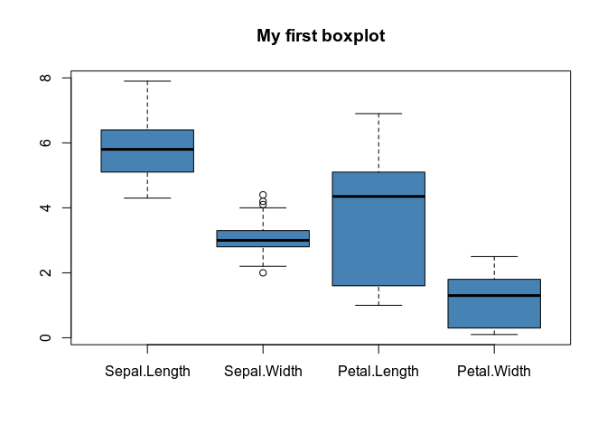
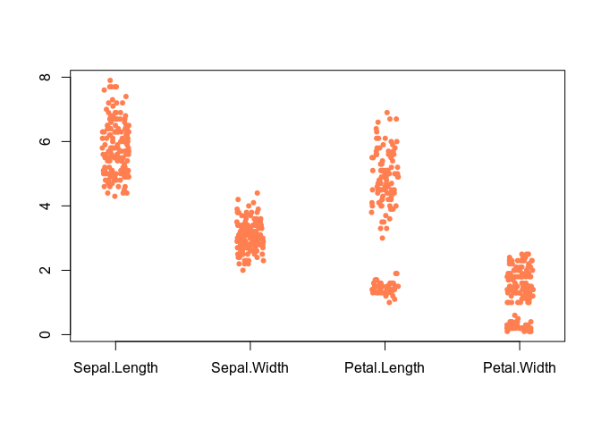
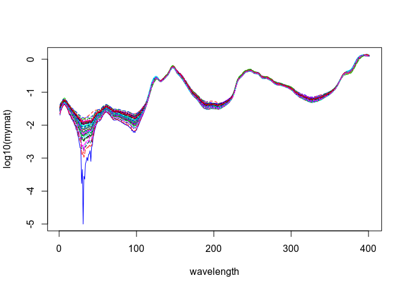

Univariate visualization
================
Pietro Franceschi
January 19, 2018

In this demo we will go trough some useful R functions which can be used to visualize (complex) data. considering the importance of this aspect we will put particular emphasis on distribution

Data
----

-   Iris Data: measurements in centimeters of the variables sepal length and width and petal length and width, respectively, for 50 flowers from each of 3 species of iris. The species are Iris setosa, versicolor, and virginica
-   Wines: the results of a chemical analysis of wines grown in the same region in Italy but derived from three different cultivars. The analysis determined the quantities of 13 constituents found in each of the three types of wines
-   rnaseq:
-   NIR: A data set with NIR spectra and octane numbers of 60 gasoline samples. The NIR spectra were measured using diffuse reflectance as log(1/R) from 900 nm to 1700 nm in 2 nm intervals, giving 401 wavelengths.

Loading the data
----------------

Some of the dataset are distributed as part of R packages, others have to be explicitly loaded from file. In this second case, in the disk they are saved as .RData files.

``` r
## load the data provided by R itself
data("iris")

## load the data from the disk (remember to set the correct working directory)
load("NIR.RData")
load("rnaseq.RData")
load("wines.RData")
```

Now some new object should be present in the "Environment" of R. To see what R actually has in the memory look to the "Environment" tab of RStudio or issue `ls` on the console

``` r
ls()
```

    ## [1] "counts"   "countsn"  "gasoline" "iris"     "vintages" "wines"

The previous output shows the "objects" containing the data. Some of the names are self explanatory, while `counts` and `countsn` are the normalized/non normalized counts per read of the rnaseq experiment, `vintages` contains the class of the wines samples, `gasoline` is the object containing the NIR data.

The Iris Dataset
----------------

I start showing you some basic plots on the `iris` dataset.

First of all let's look to the number of variables and the number of samples

``` r
## print the dimensions of the data matrix
dim(iris)
```

    ## [1] 150   5

``` r
## show the "head" of the data matrix
head(iris)
```

    ##   Sepal.Length Sepal.Width Petal.Length Petal.Width Species
    ## 1          5.1         3.5          1.4         0.2  setosa
    ## 2          4.9         3.0          1.4         0.2  setosa
    ## 3          4.7         3.2          1.3         0.2  setosa
    ## 4          4.6         3.1          1.5         0.2  setosa
    ## 5          5.0         3.6          1.4         0.2  setosa
    ## 6          5.4         3.9          1.7         0.4  setosa

``` r
## show the variable names ...
colnames(iris)
```

    ## [1] "Sepal.Length" "Sepal.Width"  "Petal.Length" "Petal.Width" 
    ## [5] "Species"

Apparently we have 4 physical characteristics and 1 variable which identify the class of the samples. When the number of variables is low, it is interesting to get a textual summary of the characteristics of my data. This task is performed by the `summary` function

``` r
summary(iris)
```

    ##   Sepal.Length    Sepal.Width     Petal.Length    Petal.Width   
    ##  Min.   :4.300   Min.   :2.000   Min.   :1.000   Min.   :0.100  
    ##  1st Qu.:5.100   1st Qu.:2.800   1st Qu.:1.600   1st Qu.:0.300  
    ##  Median :5.800   Median :3.000   Median :4.350   Median :1.300  
    ##  Mean   :5.843   Mean   :3.057   Mean   :3.758   Mean   :1.199  
    ##  3rd Qu.:6.400   3rd Qu.:3.300   3rd Qu.:5.100   3rd Qu.:1.800  
    ##  Max.   :7.900   Max.   :4.400   Max.   :6.900   Max.   :2.500  
    ##        Species  
    ##  setosa    :50  
    ##  versicolor:50  
    ##  virginica :50  
    ##                 
    ##                 
    ## 

The function plots some important statistics for the variables and a table for the factor. What can we earn from these numbers?

-   **Variable Scale**: minimum and maximum values gives us a feeling on the "size" of the different variables. Here we know that we are speaking of physical measures in centimeters, so we expect comparable scales.
-   **Normality**: If the mean and the median are almost equal, this is a good indication that the variable under consideration has a symmetric distribution around the mean. This is not a very good test for normality however. We will see `qqnorm` for that

Basic graphical functions can be used to have a visual representation of the previous characteristics

``` r
## boxplot
boxplot(iris[,1:4],             ## plot only the first 4 columns
        col = "steelblue",      ## chose a nice color
        main = "My first boxplot"
)
```



What we see here

-   The range of the variables is comparable
-   The distribution of Petal.Length is suspicious ... maybe not normal
-   There are outliers in Sepal.Width

As I stressed in the class boxplots are nice if the number of samples is big and if the data are not characterized by confounding factors. For this reason it is sometime nice to look to the "real" data points

``` r
stripchart(iris[,1:4],                     ## only the variables
           vertical = TRUE,                ## mke the plot vertical
           method = "jitter",              ## jitter the points in x
           col = "coral",                  ## another color
           pch = 19,                       ## plotting symbol!
           cex = 0.7)                      ## size
```



The picture looks more intriguing than before ... the variable which was showing an asymmetric distribution

-   Petal.Length was asymmetric because there are sub populations!
-   The same is true for Petal.Width
-   The other the variables look less strange ...

Some of these facts are not unexpected since our dataset is made up of three different iris species ... To see this we should include the specie information in the previous plots. There are fast ways of doing this by using `ggplot2`. Here we want to use only simple commands so we look to Petal.Length in the three species

As `stripchart`.

``` r
## The formula in the first line tells R to show the `Petal.Length` as a function of thespecies factor
stripchart(`Petal.Length`~Species,         ## The ` are required because there are special characters 
           data = iris,                    ## define the dataset
           vertical = TRUE,                ## mke the plot vertical
           method = "jitter",              ## jitter the points in x
           col = "orange",                  ## another color
           pch = 19,                       ## plotting symbol!
           cex = 0.7)                      ## size
```


As `boxplot`

``` r
boxplot(`Petal.Length`~Species,        
           data = iris,                 
           col = "steelblue")
```


This plot clearly shows that `Petal.Length` is actually a bio-marker which differentiates the three varieties ... in this sense, then what I'm doing now it is not optimal ... or not? What do you think?

### Variable distribution

I now use the qq-plot to check if the distribution of my data is compatible with the normal. This graphical approach allows you to plot the sample quantiles against the one of a normal distribution. In presence of perfect agreement, the points should stay on the theoretical line

``` r
qqnorm(iris$Sepal.Length)  
qqline(iris$Sepal.Length)
```


As you see the data distribution does not really agree with a normal one. But remember that the samples are in fact the sum of three species, so normality is not an expected result.

qqplots are better that histograms to compare distributions (they can be used also to compare the data against other theoretical distributions or against other data)

``` r
hist(iris$Sepal.Length, col = "red", breaks = 20)
```


The histogram suggests that the distribution has a shoulder on the right, but from this plot it is hard to draw conclusions on the distributions.

Before moving to another dataset, I would like to show you the first sort of "multivariate" plot which can be used to assess the relations among couples of variables. As we will see, highlighting the relations among the variables is the central idea behind multivariate methods. This specific plot is produced by R with the function `pairs`, it is important to remember that it is formative if your dataset contains a limited number of variables. The reason for that will be immediately clear when you look to the output.

``` r
pairs(iris[,1:4],                          ## consider only the numeric variables
      col = as.numeric(iris$Species))      ## transform the specie factor to a number ... which will be used as color
```


If you are interested in making the plot prettier, here some hints

``` r
mycol <- c("steelblue","indianred3", "deepskyblue2")

pairs(iris[,1:4],                          
      col = mycol[as.numeric(iris$Species)],
      pch = 19)
```


This plot immediately give us the feeling of the power of multivariate statistics.

**Questions**

-   Which variable do you expect will be correlated?
-   Which varieties are easier to separate? Why?
-   ...

The NIR Dataset
---------------

The NIR dataset contains infrared spectra (NIR stands for something like Near Infra Red). In our space we see an object called nirs, suppose that we do not have any idea of its content. To tackle this issue we can use the function `str`

``` r
str(gasoline)
```

    ## 'data.frame':    60 obs. of  2 variables:
    ##  $ octane: num  85.3 85.2 88.5 83.4 87.9 ...
    ##  $ NIR   : AsIs [1:60, 1:401] -0.0502 -0.0442 -0.0469 -0.0467 -0.0509 ...
    ##   ..- attr(*, "dimnames")=List of 2
    ##   .. ..$ : chr  "1" "2" "3" "4" ...
    ##   .. ..$ : chr  "900 nm" "902 nm" "904 nm" "906 nm" ...

The command shows that the `gasoline` object is a data.frame (you can thing of this type of object as an Excel table), which contains two variables. One with the number of octanes, the second which is a matrix of 60 samples and 401 variables.

In this case the use of things like `head` or `summary` is discouraged, mainly because it is difficult to handle 401 text summaries. To check the quality (and the content) of the data is better to plot the experimental spectra.

``` r
## one spectrum
plot(gasoline$NIR[1,],      ## plot the first line of the NIR table
     type = "l")            ## with a line
```


``` r
## The overall dataset
matplot(t(gasoline$NIR), ## here the t() transposes the matrix because the matplot function is designed to plot by columns
        type = "l",
        xlab = "wavelength") ## add also the x axis label
```


The data look fairly comparable, what we see is that there is a strong intensity difference between the high intensity wavelengths (like 390) and the "low intensity" regions, like 50.

To mitigate this effect log transformation can be helpful. Unfortunately we have here negative numbers! A workaround can be to shift the signal up to something slightly bigger than zero ...

``` r
## The overall dataset

mymat <- t(gasoline$NIR) - min(gasoline$NIR) + 0.00001

matplot(log10(mymat), ## here the t() transposes the matrix because the matplot function is designed to plot by columns
        type = "l",
        xlab = "wavelength") ## add also the x axis label
```



Now the plot is more interesting. The variability is bigger on low intensity areas.

**Questions**

-   Is this what you would expect? Why?
-   Would it be safe to scale the values and make the low intensity variables important as the high intensity ones?
-   ...

Its your turn ...
-----------------

Play around and visualize rnaseq and the wine dataset!
