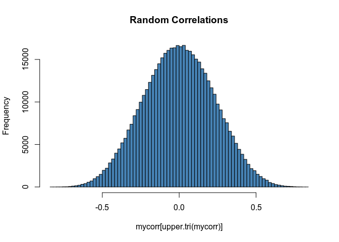
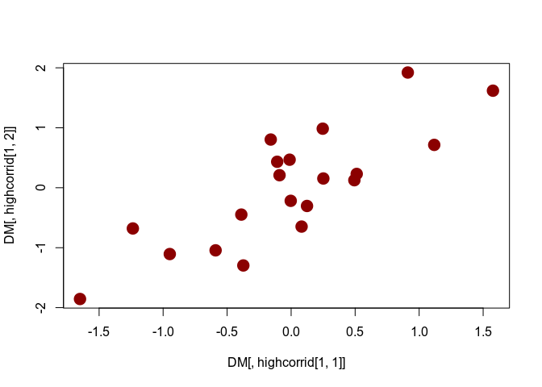

False Positives
================
Pietro Franceschi
4 February 2019

This first demo deals with "random organization". Asw we discussed in the lecture, an experiment is always performed on a subset of the population, so a measured "organization"

-   can mirror a population level characteristics
-   can be the result of a "unlucky" sampling

To undertand the second point, just consider an hypothetic sampling of the human population made by an extraterrestrial entity. If he random sample a couple of humans, it will likely conclude that we are all chinese!

Let's make a more scientific example. Let's create a fake proteomics experiment where I'm measuring the concentration of 1000 proteins on a group of 20 samples. And let's suppose that I want to study the correlation between the different proteins to infer new regulatory networks ...

To simulate a dummy experiment I will fill my expression matrix with random numbers ...

``` r
## Random expression data matrix

DM <- matrix(rnorm(20000), nrow = 20)
dim(DM)
```

    ## [1]   20 1000

That's the data matrix. Is there true organization there? NO!

Let's calculate the correlation among the different proteins ...

``` r
mycorr <- cor(DM)
dim(mycorr)
```

    ## [1] 1000 1000

Now we get only the upper triangle of the matrix and we look to the distribution of the correlation coefficients

``` r
hist(mycorr[upper.tri(mycorr)], 
     col = "steelblue", 
     breaks = 100,
     main = "Random Correlations")
```



Unexpectedly ( ;-) ) ... we also have high correlation variables! The code below gives you the indices of the variables showing high correlation, excluding the 1s

``` r
highcorrid <- which(mycorr > 0.8 & mycorr != 1, arr.ind = TRUE)
highcorrid
```

    ##       row col
    ##  [1,] 990 107
    ##  [2,] 893 165
    ##  [3,] 641 436
    ##  [4,] 635 568
    ##  [5,] 924 629
    ##  [6,] 568 635
    ##  [7,] 436 641
    ##  [8,] 913 695
    ##  [9,] 929 806
    ## [10,] 165 893
    ## [11,] 695 913
    ## [12,] 629 924
    ## [13,] 806 929
    ## [14,] 107 990

``` r
plot(DM[,highcorrid[1,1]],DM[,highcorrid[1,2]], col = "darkred", pch = 19, cex = 2)
```



Here the presence of high correlation is clear!!! But this correlation does not have a "biological" origin ... so it does not represent a truly scientific result ...
