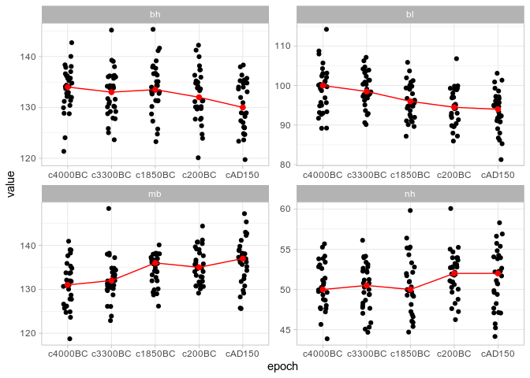
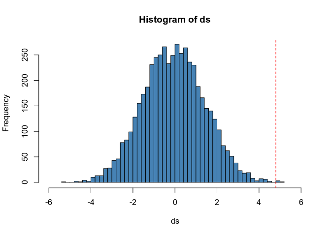

Statistical Testing on the Skull Data
================
Pietro Franceschi
4 February 2019

``` r
library(readr)
library(tidyverse)
```

    ## ── Attaching packages ────────────────────────────────────────────────────────────────────────────────────────────────────────────────────────────────── tidyverse 1.3.0 ──

    ## ✓ ggplot2 3.3.1     ✓ dplyr   1.0.0
    ## ✓ tibble  3.0.1     ✓ stringr 1.4.0
    ## ✓ tidyr   1.1.0     ✓ forcats 0.5.0
    ## ✓ purrr   0.3.4

    ## ── Conflicts ───────────────────────────────────────────────────────────────────────────────────────────────────────────────────────────────────── tidyverse_conflicts() ──
    ## x dplyr::filter() masks stats::filter()
    ## x dplyr::lag()    masks stats::lag()

``` r
library(knitr)
```

# Brute Force Statistical Testing

Measurements made on Egyptian skulls from five epochs.

  - epoch: the epoch the skull as assigned to, a factor with levels
    c4000BC c3300BC, c1850BC, c200BC, and cAD150, where the years are
    only given approximately, of course.
  - mb: maximum breaths of the skull.
  - bh: basibregmatic heights of the skull.
  - bl: basialiveolar length of the skull.
  - nh: nasal heights of the
skull.


``` r
library(readr)
skulls <- read_csv("data/skulls.csv")
head(skulls)
```

    ## # A tibble: 6 x 5
    ##   epoch      mb    bh    bl    nh
    ##   <chr>   <dbl> <dbl> <dbl> <dbl>
    ## 1 c4000BC   131   138    89    49
    ## 2 c4000BC   125   131    92    48
    ## 3 c4000BC   131   132    99    50
    ## 4 c4000BC   119   132    96    44
    ## 5 c4000BC   136   143   100    54
    ## 6 c4000BC   138   137    89    56

Let’s visualize the characteristics as a function of the year

``` r
skulls %>% 
  mutate(epoch = factor(epoch, levels = c("c4000BC", "c3300BC", "c1850BC","c200BC","cAD150"))) %>% 
  pivot_longer(-epoch) %>% 
  ggplot(aes(x = epoch, y = value)) + 
  geom_jitter(width = 0.1) +
  stat_summary(fun.y=median, geom="line", aes(group=name), col  ="red")  + 
  stat_summary(fun.y=median, geom="point", size = 2, col = "red") +  
  facet_wrap(~name, scales = "free") +
  theme_light()
```

    ## Warning: `fun.y` is deprecated. Use `fun` instead.
    
    ## Warning: `fun.y` is deprecated. Use `fun` instead.

<!-- -->

Let’s focus on mb. Is there a significant difference between 4000BC and
150AD?

``` r
## Here we subset the dataset

data <- skulls %>% 
  select(epoch,mb) %>% 
  filter(epoch %in% c("c4000BC","cAD150"))
```

The strategy: \* the statistics we calculate is the different between
the means of the two groups (d) \* H0: the skulls are not different \*
to construct the **empirical** distribution of d under the null
hypothesis we shuffle the `epoch` label 5000 times (i.e. we assign each
skull randomly to the epoch preserving class imbalance) \* we calculate
how many times we obtain a d bigger than the observed one … the
proportion of this number will be the *empirical p-value*

``` r
## this is the "real" d
d <- mean(data$mb[data$epoch == "cAD150"]) - mean(data$mb[data$epoch == "c4000BC"])

## let's perform the permutation
ds <- rep(0,5000)

for (i in 1:5000){
  mb_r <- sample(data$mb)
  ds[i] <- mean(mb_r[data$epoch == "cAD150"]) - mean(mb_r[data$epoch == "c4000BC"])
}
```

Now we plot the results …

``` r
hist(ds, col = "steelblue", breaks = 40, xlim = c(-6,6))
abline(v = d, col = "red", lty = 2)
```

<!-- -->

  - the histogram shows the empirical distribution of the 500
    differences
  - as one can expect, the distribution is centered around zero and
    fairly symmetric
  - the red line shows the value of *d*

To calculate the empirical p-value we need to calculate how many times
we get a d larger than the observed one under H0

``` r
emp_p <- length(which(ds > d))/5000

emp_p
```

    ## [1] 8e-04

The results is significant at the 0.01 level of confidence

**Notes**

  - The proposed procedure is non parametric and completely assumption
    free
  - With a low number of samples the possible permutation could be
    limited
  - With a lower number of samples parametric test (as the t-test) would
    have bigger power
